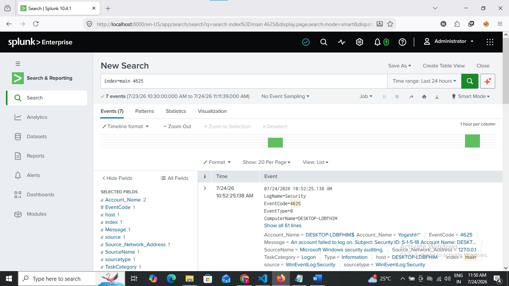
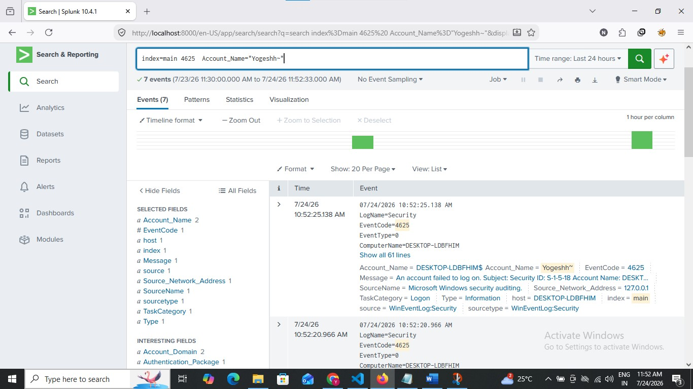
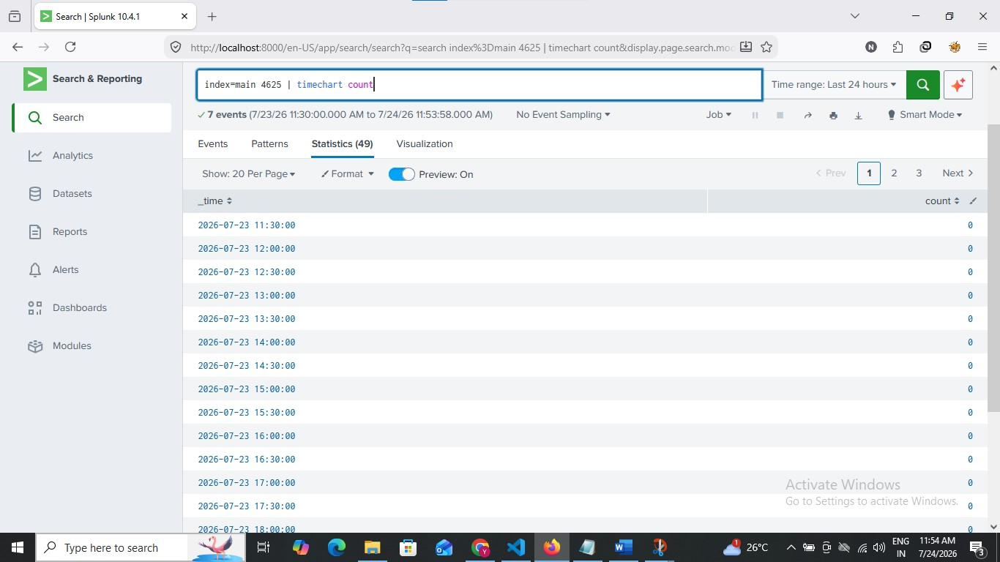

# Splunk Queries

## View Failed Login Events

```spl
index=main EventCode=4625
```
## Search Query



## Display Important Fields

```spl
index=main EventCode=4625
| table _time Account_Name Logon_Type Source_Network_Address Failure_Reason Status Sub_Status
```

## Count Failed Logins

```spl
index=main EventCode=4625
| stats count by Account_Name
```
## User Analysis



## Timeline

```spl
index=main EventCode=4625
| timechart count
```
## Timeline

