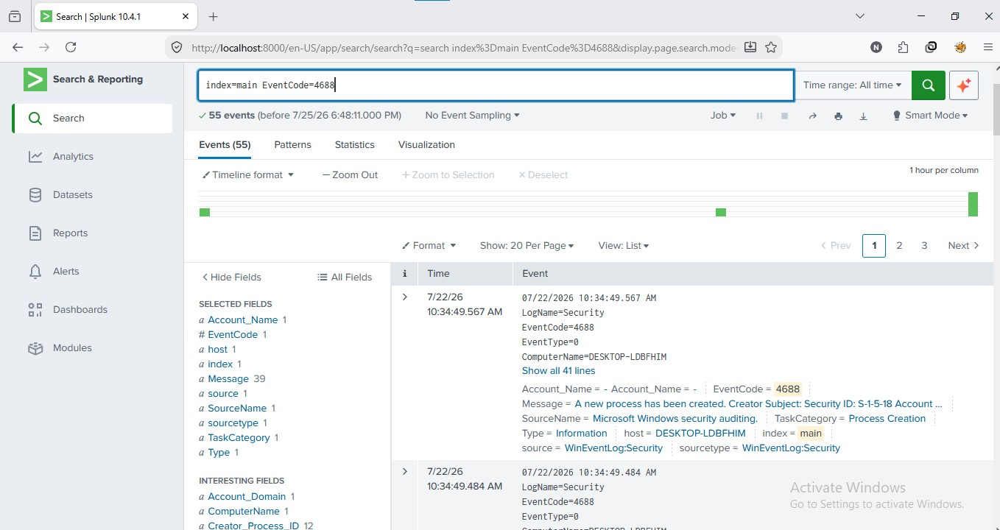
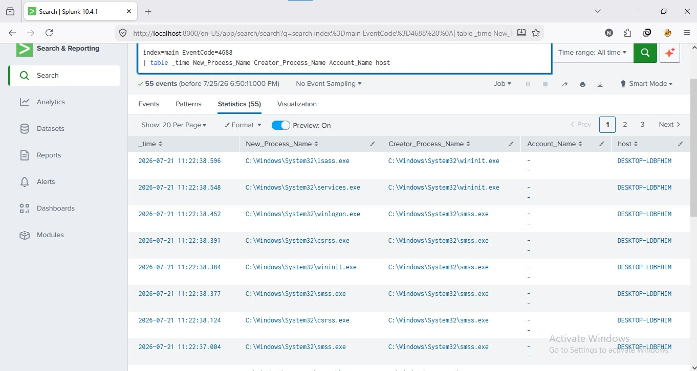
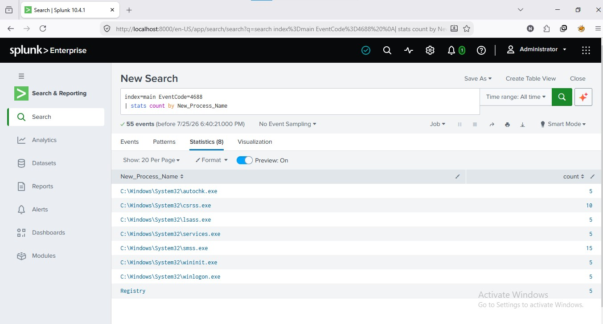

#  Windows Process Creation Monitoring (Event ID 4688)

## 📌 Project Overview

This project demonstrates how a SOC Analyst can monitor Windows Process Creation events using **Microsoft Windows Security Event ID 4688** in **Splunk Enterprise**.

The objective of this project is to identify newly created processes, analyze parent-child process relationships, detect suspicious applications, and build a dashboard for process monitoring.


# Lab Environment
 SIEM - Splunk Enterprise 10.4 

 Log Source - Windows Security Logs 

 Operating System - Windows 10 

 Event ID - 4688 

 Host - DESKTOP-LDBFHIM 


# Objective

Monitor Windows process creation events.

Identify newly executed processes.

Analyze parent-child process relationships.

Detect suspicious process execution.

Create a dashboard for process monitoring.

# Windows Event ID 4688

Event ID **4688** is generated whenever a **new process is created** on a Windows system.

SOC analysts use this event to:

 Detect malware execution

 Detect PowerShell abuse

 Detect CMD execution

 Detect LOLBins

 Investigate ransomware

 Investigate process injection

 Build attack timelines

## 📷 Process Creation Events


# Event Details

Example Process:

```
New Process Name:
C:\Windows\System32\lsass.exe

Creator Process:
C:\Windows\System32\wininit.exe

Event ID:
4688

Task Category:
Process Creation
```
## 📷 Process Details



# Splunk Searches Used
 Search all Process Creation Events

 Display Process Details

 Count Executed Processes

 Top Parent Processes

 Process Timeline

 Search Suspicious Processes


# Dashboard Panels

✅ Total Processes Created

✅ Top Executed Processes

✅ Process Creation Timeline

✅ Top Parent Processes

✅ Suspicious Process Search

## 📷 Top Executed Processes



# Skills Demonstrated
 Splunk SPL

 Windows Event Analysis

 Process Monitoring

 Log Investigation

 Dashboard Creation

 SOC Investigation

 Security Monitoring

# Outcome

Successfully monitored Windows Process Creation events using Event ID 4688.

Performed log analysis using Splunk SPL.

Created visual dashboards for process monitoring.

Documented the investigation process similar to a real SOC Analyst workflow.